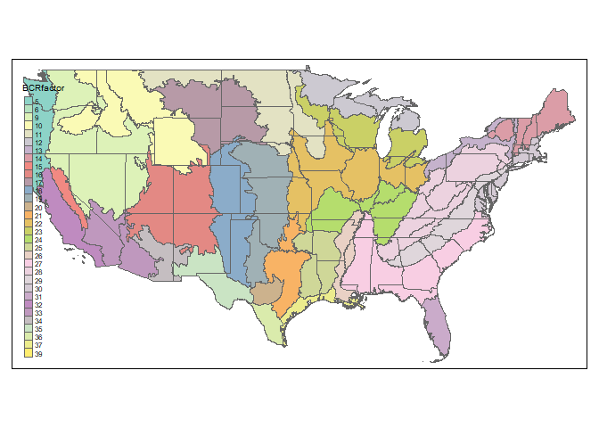
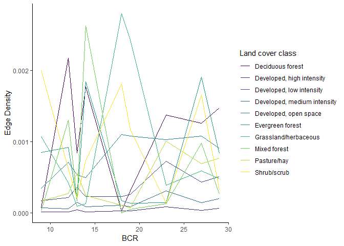
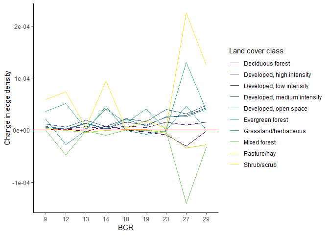
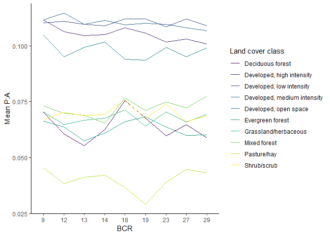
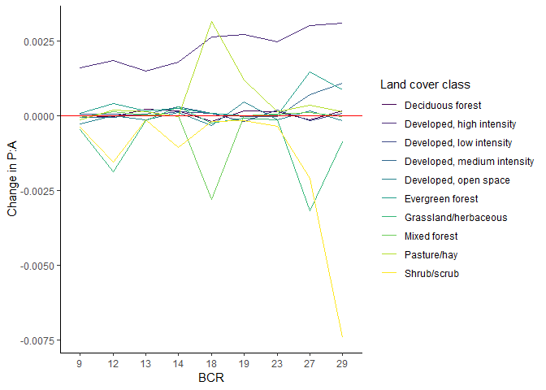

ENEC891 Research Presentation
================
Grace Di Cecco
November 27, 2018

``` r
library(tidyverse)
```

    ## -- Attaching packages ----------------------------------------------------------------------------------- tidyverse 1.2.1 --

    ## v ggplot2 3.0.0     v purrr   0.2.5
    ## v tibble  1.4.2     v dplyr   0.7.6
    ## v tidyr   0.8.1     v stringr 1.3.1
    ## v readr   1.1.1     v forcats 0.3.0

    ## -- Conflicts -------------------------------------------------------------------------------------- tidyverse_conflicts() --
    ## x dplyr::filter() masks stats::filter()
    ## x dplyr::lag()    masks stats::lag()

``` r
library(sf)
```

    ## Linking to GEOS 3.6.1, GDAL 2.2.3, PROJ 4.9.3

``` r
library(raster)
```

    ## Loading required package: sp

    ## 
    ## Attaching package: 'raster'

    ## The following object is masked from 'package:dplyr':
    ## 
    ##     select

    ## The following object is masked from 'package:tidyr':
    ## 
    ##     extract

``` r
library(SDMTools)
```

    ## 
    ## Attaching package: 'SDMTools'

    ## The following object is masked from 'package:raster':
    ## 
    ##     distance

``` r
library(tmap)

# package foreach [for each region]
```

Area of study
-------------

[Bird Conservation Regions](http://nabci-us.org/resources/bird-conservation-regions-map/) in continental US.

``` r
bcrshp <- read_sf("\\\\Bioark.bio.unc.edu\\hurlbertlab\\DiCecco\\bcr_terrestrial_shape\\BCR_Terrestrial_master.shp")
#bcrshp <- read_sf("/Volumes/hurlbertlab/DiCecco/bcr_terrestrial_shape/BCR_Terrestrial_master.shp")
#BCRs

bcrs.us <- bcrshp %>%
  filter(!is.na(REGION), REGION == "USA", PROVINCE_S != "ALASKA", PROVINCE_S != "HAWAIIAN ISLANDS") %>%
  dplyr::select(BCR) %>%
  mutate(BCRfactor = as.factor(BCR))

map_bcrs <- tm_shape(bcrs.us) + tm_borders() + tm_fill(col = "BCRfactor", palette = "cat") + tmap_options(max.categories = 32)
map_bcrs
```



For my project, I looked at a subset of BCRs: 9 - Great Basin 12 - Boreal Hardwood Transition 13 - Lower Great Lakes 14 - Atlantic Northern Forests 18 - Shortgrass Prairie 19 - Central Mixed Grass Prairie 23 - Prairie Hardwood Transition 27 - Southeastern Coastal Plain 29 - Piedmont

I picked these BCRs to be representative of different major habitat types (grassland, forest), urbanization gradients (dense urban, suburban, rural), and impacts of climate change to date (e.g. more intense warming in northern BCRs).

``` r
bcrs <- c(9, 12, 13, 14, 18, 19, 23, 27, 29) # BCRs of interest
bcr_sub <- bcrs.us %>%
  filter(BCR %in% bcrs)

map_bcr_sub <- tm_shape(bcrs.us) + tm_borders()
map_bcr_sub + tm_shape(bcr_sub) + tm_fill(col = "BCRfactor", palette = "cat") + tm_borders() + tm_legend(show = F)
```


Data source
-----------

NLCD dataset from 4 time points: 1992, 2001, 2006, 2011. Freely available for [download](http://nabci-us.org/resources/bird-conservation-regions-map/).

Divides land cover into [20 classes](https://www.mrlc.gov/data/legends/national-land-cover-database-2011-nlcd2011-legend). Some changes in classification between 1992 and 2000's: mainly in classification of developed land and shrubland. No changes in forest/grassland categories.

Fragmentation measures
----------------------

SDMtools package: enables calculation of Fragstats-like habitat fragmentation metrics from raster files in R.

``` r
?ClassStat
```

    ## starting httpd help server ... done

``` r
?PatchStat
```

Analysis workflow: - Merge NLCD rasters to continental US (when necessary) - Crop NLCD raster with BCR shapefile - Calculate fragmentation measures on each BCR region for each timepoint

EDA/Plots of habitat fragmentation over time in study regions
-------------------------------------------------------------

``` r
frags <- read.csv("\\\\BioArk\\hurlbertlab\\DiCecco\\data\\fragmentation_indices_nlcd_bcrs.csv", stringsAsFactors = F)
#frags <- read.csv("/Volumes/hurlbertlab/DiCecco/data/fragmentation_indices_nlcd_bcrs.csv", stringsAsFactors = F)
```

Matching land cover classes over time \[<https://pubs.usgs.gov/of/2008/1379/pdf/ofr2008-1379.pdf>\]. There was a change in legend used from 1992 to the 2000's data, so I used this chart to match legends from different time points.

``` r
classlegend00s <- data.frame(class = c(11:12, 21:24, 31, 41:43, 51, 52, 71, 81:82, 90, 95), 
                          legend = c("Open water", "Perennial ice/snow", "Developed, open space", "Developed, low intensity", "Developed, medium intensity", "Developed, high intensity", "Barren land", "Deciduous forest", "Evergreen forest", "Mixed forest", "Dwarf scrub", "Shrub/scrub", "Grassland/herbaceous", "Pasture/hay", "Cultivated crops", "Woody wetlands", "Emergent herbaceous wetlands"))
classlegend92 <- data.frame(class = c(11:12, 85, 21:23, 31:33, 41:43, 51, 61, 71, 81:84, 91:92),
                            legend = c("Open water", "Perennial ice/snow", "Developed, open space", "Developed, low intensity", "Developed, medium intensity", "Developed, high intensity", "Barren land", "Barren land", "Barren land", "Deciduous forest", "Evergreen forest", "Mixed forest", "Shrub/scrub", "Cultivated crops", "Grassland/herbaceous", "Pasture/hay",  "Cultivated crops",  "Cultivated crops",  "Cultivated crops", "Woody wetlands", "Emergent herbaceous wetlands"))

frags.92 <- frags %>%
  filter(year == 1992) %>%
  left_join(classlegend92)
```

    ## Joining, by = "class"

``` r
frags.00s <- frags %>%
  filter(year > 1992) %>%
  left_join(classlegend00s)
```

    ## Joining, by = "class"

``` r
# Filter out land cover classes of interest only
frags.legend <- bind_rows(frags.92, frags.00s)
```

    ## Warning in bind_rows_(x, .id): Unequal factor levels: coercing to character

    ## Warning in bind_rows_(x, .id): binding character and factor vector,
    ## coercing into character vector

    ## Warning in bind_rows_(x, .id): binding character and factor vector,
    ## coercing into character vector

``` r
frags.filter <- frags.legend %>%
  filter(legend %in% c("Developed, open space", "Developed, low intensity", "Developed, medium intensity", "Developed, high intensity", "Cultivated Crops", "Pasture/hay", "Deciduous forest", "Evergreen forest", "Mixed forest", "Shrub/scrub", "Grassland/herbaceous"))
```

EDA of fragmentation of developed, forested, and grassland land cover in regions of interest

``` r
# Proportion of landscape deltas
frags.01 <- filter(frags.filter, year == 2001)
frags.11 <- filter(frags.filter, year == 2011)
frags.deltas <- frags.11 %>%
  mutate(delta.PL = prop.landscape - frags.01$prop.landscape) %>%
  mutate(delta.ED = edge.density - frags.01$edge.density) %>%
  mutate(delta.PAR = mean.perim.area.ratio - frags.01$mean.perim.area.ratio)
```

``` r
theme_set(theme_classic())
# Proportion of landscape
ggplot(filter(frags.filter, year == 2011), aes(x = as.factor(bcr), y = prop.landscape, fill = legend)) + geom_col(position = "stack") + labs(x = "BCR", y = "Proportion of landscape", fill = "Land cover class") + scale_fill_viridis_d()
```


``` r
# low proportions include the great lakes
# recalculate proportion as proportion of land cover classes excluding water/maybe ag land

ggplot(frags.deltas, aes(x = as.factor(bcr), y = delta.PL, color = legend)) + geom_point() + geom_hline(yintercept = 0, color = "red") + labs(x = "BCR", y = "Change in proportion of landscape", color = "Land cover class") + scale_color_viridis_d()
```


``` r
# Change relative to starting amount
# Table
# Facet on log/logit scale
```

These figures show the variation in land cover change between BCRs used: eastern BCRs (27 and 29) show increase in shrub/scrub lands and developed lands, while western BCRs (18 and 19) show decreases in shrubland and smaller increase in urbanization.

``` r
# Edge density
ggplot(filter(frags.filter, year == 2011), aes(x = bcr, y = edge.density, color = legend)) + geom_line() + labs(x = "BCR", y = "Edge Density", color = "Land cover class") + scale_color_viridis_d()
```



``` r
# High edge density indicates high edge length per unit area - highly fragmented

# Edge density deltas
ggplot(frags.deltas, aes(x = as.factor(bcr), y = delta.ED, color = legend)) + geom_line(aes(group = legend)) + geom_hline(yintercept = 0, color = "red") + labs(x = "BCR", y = "Change in edge density", color = "Land cover class") + scale_color_viridis_d()
```



There is the highest variation in changes in edge density of pasture/hay, shrub/scrub, mixed forest, and grassland/herbaceous land cover types between BCRs.

Urban land cover types show increases in edge density in almost all BCRs, but with less variation between BCRs.

``` r
# Perimeter area ratio over time
ggplot(filter(frags.filter, year == 2011), aes(x = as.factor(bcr), y = mean.perim.area.ratio, color = legend)) + geom_line(aes(group = legend)) + labs(x = "BCR", y = "Mean P:A", color = "Land cover class") + scale_color_viridis_d()
```



``` r
# High PAR indicates lots of patches - highly fragmented

# Perimeter area ratio deltas
ggplot(frags.deltas, aes(x = as.factor(bcr), y = delta.PAR, color = legend)) + geom_line(aes(group = legend)) + geom_hline(yintercept = 0, color = "red") + labs(x = "BCR", y = "Change in P:A", color = "Land cover class") + scale_color_viridis_d()
```



Using perimeter to area ratio as the measure of fragmentation yields slightly different results: mixed forest, pasture/hay, and shrub/scrub still show the greatest variation between BCRs, however the direction of change is not always uniform. Additionally, this measure shows increased patchiness in developed land, which may represent increases in urban sprawl, especially in Great Basin and Eastern forest biome types.

### Conclusions and future directions:

Edge density will be the most relevant fragmentation measure for my project going forward, since it has the clearest translation to habitat factors that matter to birds. Many bird species can be grouped into edge-tolerant or edge-avoiding, and edge density will provide a useful way to measure how habitat fragmentation is impacting my taxonomic group of interest.

Additionally, I plan to repeat this analysis on the route level, as opposed to regional (using the BCRs). I think this will provide several benefits: 1) I'll be able to capture a greater range of variation, 2) I'll be able to make use of a larger sample size of bird population data by conducting the analysis on the route level, and 3) I can expand my region of interest to the continental US and potentially Alaska as well.

I also plan to include cultivated cropland in future analyses, since this land cover type can provide important habitat for many highly abundant bird species that I'm interested in including in my analysis.
