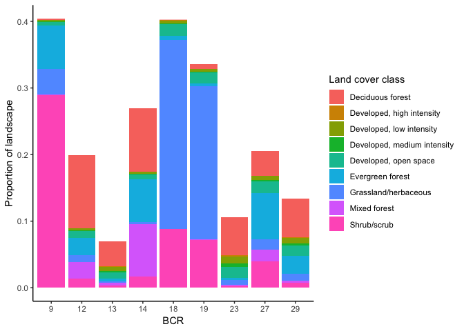
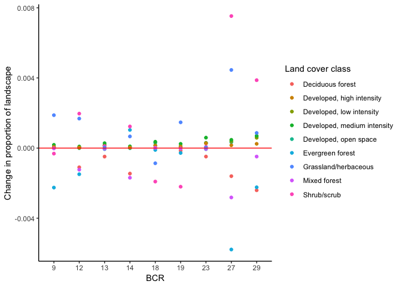
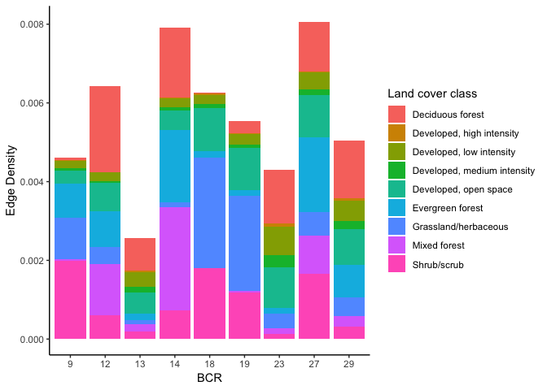
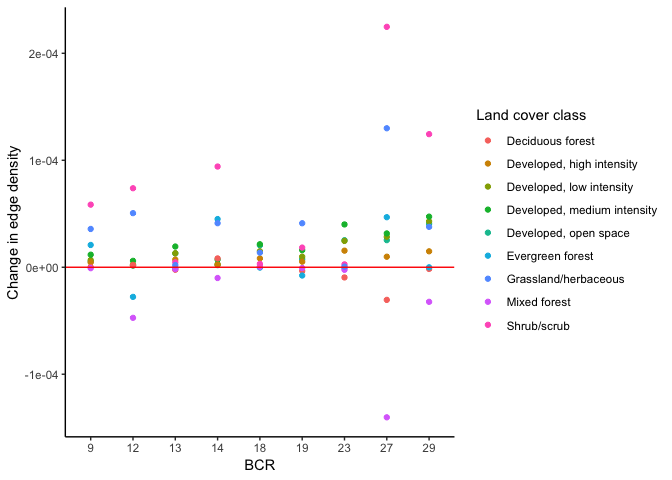
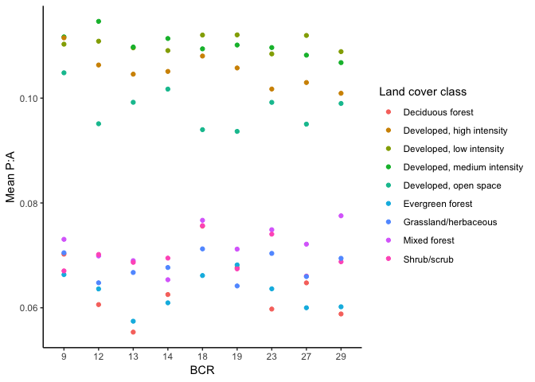
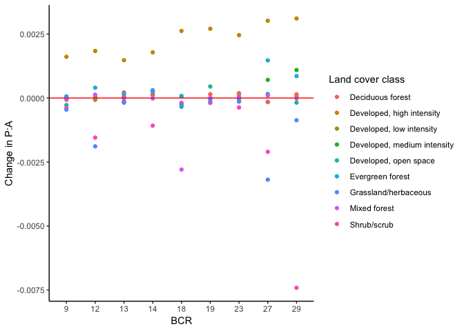

ENEC891 Research Presentation
================
Grace Di Cecco
November 27, 2018

``` r
library(tidyverse)
```

    ## ── Attaching packages ────────────────────────────────── tidyverse 1.2.1 ──

    ## ✔ ggplot2 3.0.0     ✔ purrr   0.2.5
    ## ✔ tibble  1.4.2     ✔ dplyr   0.7.6
    ## ✔ tidyr   0.8.1     ✔ stringr 1.3.1
    ## ✔ readr   1.1.1     ✔ forcats 0.3.0

    ## ── Conflicts ───────────────────────────────────── tidyverse_conflicts() ──
    ## ✖ dplyr::filter() masks stats::filter()
    ## ✖ dplyr::lag()    masks stats::lag()

``` r
library(sf)
```

    ## Linking to GEOS 3.6.1, GDAL 2.1.3, proj.4 4.9.3

``` r
library(raster)
```

    ## Loading required package: sp

    ## 
    ## Attaching package: 'raster'

    ## The following object is masked from 'package:dplyr':
    ## 
    ##     select

    ## The following object is masked from 'package:tidyr':
    ## 
    ##     extract

``` r
library(SDMTools)
```

    ## 
    ## Attaching package: 'SDMTools'

    ## The following object is masked from 'package:raster':
    ## 
    ##     distance

``` r
library(tmap)
```

Area of study
-------------

[Bird Conservation Regions](http://nabci-us.org/resources/bird-conservation-regions-map/) in continental US.

``` r
#bcrshp <- read_sf("\\\\Bioark.bio.unc.edu\\hurlbertlab\\DiCecco\\bcr_terrestrial_shape\\BCR_Terrestrial_master.shp")
bcrshp <- read_sf("/Volumes/hurlbertlab/DiCecco/bcr_terrestrial_shape/BCR_Terrestrial_master.shp")
#BCRs

bcrs.us <- bcrshp %>%
  filter(!is.na(REGION), REGION == "USA", PROVINCE_S != "ALASKA", PROVINCE_S != "HAWAIIAN ISLANDS") %>%
  dplyr::select(BCR) %>%
  mutate(BCRfactor = as.factor(BCR))

map_bcrs <- tm_shape(bcrs.us) + tm_borders() + tm_fill(col = "BCRfactor", palette = "cat") + tmap_options(max.categories = 32)
map_bcrs
```


For my project, I looked at a subset of BCRs: 9 - Great Basin 12 - Boreal Hardwood Transition 13 - Lower Great Lakes 14 - Atlantic Northern Forests 18 - Shortgrass Prairie 19 - Central Mixed Grass Prairie 23 - Prairie Hardwood Transition 27 - Southeastern Coastal Plain 29 - Piedmont

``` r
bcrs <- c(9, 12, 13, 14, 18, 19, 23, 27, 29) # BCRs of interest
bcr_sub <- bcrs.us %>%
  filter(BCR %in% bcrs)

map_bcr_sub <- tm_shape(bcrs.us) + tm_borders()
map_bcr_sub + tm_shape(bcr_sub) + tm_fill(col = "BCRfactor", palette = "cat") + tm_borders() + tm_legend(show = F)
```


Data source
-----------

NLCD dataset from 4 time points: 1992, 2001, 2006, 2011. Freely available for [download](https://catalog.data.gov/dataset/national-land-cover-database-nlcd-land-cover-collection).

Divides land cover into [20 classes](https://www.mrlc.gov/data/legends/national-land-cover-database-2011-nlcd2011-legend). Some changes in classification between 1992 and 2000's: mainly in classification of developed land and shrubland. No changes in forest/grassland categories.

Fragmentation measures
----------------------

SDMtools package: enables calculation of Fragstats-like habitat fragmentation metrics from raster files in R.

``` r
?ClassStat
```

Analysis workflow: - Merge NLCD rasters to continental US (when necessary) - Crop NLCD raster with BCR shapefile - Calculate fragmentation measures on each BCR region for each timepoint

EDA/Plots of habitat fragmentation over time in study regions
-------------------------------------------------------------

``` r
#frags <- read.csv("\\\\Bioark.bio.unc.edu\\hurlbertlab\\DiCecco\\data\\fragmentation_indices_nlcd.csv", stringsAsFactors = F)
frags <- read.csv("/Volumes/hurlbertlab/DiCecco/data/fragmentation_indices_nlcd.csv", stringsAsFactors = F)
head(frags)
```

    ##                              file year bcr class n.patches  total.area
    ## 1 nlcd_30x30_1992_bcr_12_frag.csv 1992  12    11    221578 14629158000
    ## 2 nlcd_30x30_1992_bcr_12_frag.csv 1992  12    21     35607   267683400
    ## 3 nlcd_30x30_1992_bcr_12_frag.csv 1992  12    22     24323   181079100
    ## 4 nlcd_30x30_1992_bcr_12_frag.csv 1992  12    23    104036   737330400
    ## 5 nlcd_30x30_1992_bcr_12_frag.csv 1992  12    31      7237    49618800
    ## 6 nlcd_30x30_1992_bcr_12_frag.csv 1992  12    32     12508   510030000
    ##   prop.landscape patch.density total.edge edge.density
    ## 1   2.477465e-02  3.752450e-07  149475900 2.531392e-04
    ## 2   4.533251e-04  6.030088e-08   15505680 2.625906e-05
    ## 3   3.066596e-04  4.119129e-08   10471380 1.773341e-05
    ## 4   1.248678e-03  1.761862e-07   50954820 8.629260e-05
    ## 5   8.403003e-05  1.225595e-08    3017820 5.110714e-06
    ## 6   8.637419e-04  2.118245e-08   10427640 1.765933e-05
    ##   landscape.shape.index largest.patch.index mean.patch.area sd.patch.area
    ## 1              308.9366        1.951481e-03       66022.611    3917476.94
    ## 2              236.8726        6.707832e-06        7517.718      56509.55
    ## 3              194.3463        8.995597e-06        7444.768      70969.42
    ## 4              468.9382        1.334250e-04        7087.262     252583.60
    ## 5              107.0149        2.716055e-06        6856.266      41914.05
    ## 6              115.4011        8.317346e-05       40776.303     788986.86
    ##   min.patch.area max.patch.area perimeter.area.frac.dim
    ## 1            900     1152327600              0.02043484
    ## 2            900        3960900              0.11584478
    ## 3            900        5311800              0.11564909
    ## 4            900       78786000              0.13820869
    ## 5            900        1603800              0.12163318
    ## 6            900       49113000              0.04088967
    ##   mean.perim.area.ratio sd.perim.area.ratio min.perim.area.ratio
    ## 1            0.09834027          0.03698227         0.0002529978
    ## 2            0.11117549          0.02689886         0.0196078431
    ## 3            0.11119374          0.02650239         0.0144086022
    ## 4            0.11251127          0.02595215         0.0156347717
    ## 5            0.11221453          0.02574253         0.0155897436
    ## 6            0.10764988          0.03108596         0.0039430512
    ##   max.perim.area.ratio mean.shape.index sd.shape.index min.shape.index
    ## 1            0.1333333         1.220655      0.4703012               1
    ## 2            0.1333333         1.226910      0.5987250               1
    ## 3            0.1333333         1.222212      0.6035672               1
    ## 4            0.1333333         1.244932      0.8810333               1
    ## 5            0.1333333         1.253488      0.5667194               1
    ## 6            0.1333333         1.263898      0.7308657               1
    ##   max.shape.index mean.frac.dim.index sd.frac.dim.index min.frac.dim.index
    ## 1        36.04831            1.042747        0.05103917                  1
    ## 2        17.81955            1.040545        0.05947993                  1
    ## 3        15.74675            1.039948        0.05899941                  1
    ## 4       170.86824            1.040804        0.06304040                  1
    ## 5        10.34118            1.045778        0.06305044                  1
    ## 6        21.71646            1.043631        0.06019820                  1
    ##   max.frac.dim.index total.core.area prop.landscape.core
    ## 1           1.446681     11403452700        1.931188e-02
    ## 2           1.379503        26172900        4.432412e-05
    ## 3           1.369513        19820700        3.356659e-05
    ## 4           1.565533        42898500        7.264913e-05
    ## 5           1.327955         5692500        9.640317e-06
    ## 6           1.376659       288193500        4.880592e-04
    ##   mean.patch.core.area sd.patch.core.area min.patch.core.area
    ## 1           51464.7334         3845298.70                   0
    ## 2             735.0493           13123.83                   0
    ## 3             814.8954           20662.06                   0
    ## 4             412.3428           20151.87                   0
    ## 5             786.5828           15276.37                   0
    ## 6           23040.7339          578530.19                   0
    ##   max.patch.core.area prop.like.adjacencies aggregation.index
    ## 1          1138377600             0.8576441          92.35966
    ## 2             1215000             0.3942715          56.65983
    ## 3             1575000             0.3949848          56.75592
    ## 4             4347000             0.3172594          48.22292
    ## 5              711900             0.3734842          54.61774
    ## 6            40500000             0.7340961          84.77879
    ##   lanscape.division.index splitting.index effective.mesh.size
    ## 1               0.9999902    1.025091e+05        5.760354e+06
    ## 2               1.0000000    3.013265e+09        1.959631e+02
    ## 3               1.0000000    2.815325e+09        2.097410e+02
    ## 4               1.0000000    5.249185e+07        1.124915e+04
    ## 5               1.0000000    2.671381e+10        2.210426e+01
    ## 6               1.0000000    4.466550e+07        1.322025e+04
    ##   patch.cohesion.index
    ## 1             9.969944
    ## 2             9.487822
    ## 3             9.591129
    ## 4             9.785018
    ## 5             9.396667
    ## 6             9.912726

Matching land cover classes over time \[<https://pubs.usgs.gov/of/2008/1379/pdf/ofr2008-1379.pdf>\]

``` r
classlegend00s <- data.frame(class = c(11:12, 21:24, 31, 41:43, 51, 52, 71, 81:82, 90, 95), 
                          legend = c("Open water", "Perennial ice/snow", "Developed, open space", "Developed, low intensity", "Developed, medium intensity", "Developed, high intensity", "Barren land", "Deciduous forest", "Evergreen forest", "Mixed forest", "Dwarf scrub", "Shrub/scrub", "Grassland/herbaceous", "Pasture/hay", "Cultivated crops", "Woody wetlands", "Emergent herbaceous wetlands"))
classlegend92 <- data.frame(class = c(11:12, 85, 21:23, 31:33, 41:43, 51, 61, 71, 81:84, 91:92),
                            legend = c("Open water", "Perennial ice/snow", "Developed, open space", "Developed, low intensity", "Developed, medium intensity", "Developed, high intensity", "Barren land", "Barren land", "Barren land", "Deciduous forest", "Evergreen forest", "Mixed forest", "Shrub/scrub", "Cultivated crops", "Grassland/herbaceous", "Pasture/hay",  "Cultivated crops",  "Cultivated crops",  "Cultivated crops", "Woody wetlands", "Emergent herbaceous wetlands"))

frags.92 <- frags %>%
  filter(year == 1992) %>%
  left_join(classlegend92)
```

    ## Joining, by = "class"

``` r
frags.00s <- frags %>%
  filter(year > 1992) %>%
  left_join(classlegend00s)
```

    ## Joining, by = "class"

``` r
# Filter out land cover classes of interest only
frags.legend <- bind_rows(frags.92, frags.00s)
```

    ## Warning in bind_rows_(x, .id): Unequal factor levels: coercing to character

    ## Warning in bind_rows_(x, .id): binding character and factor vector,
    ## coercing into character vector

    ## Warning in bind_rows_(x, .id): binding character and factor vector,
    ## coercing into character vector

``` r
frags.filter <- frags.legend %>%
  filter(legend %in% c("Developed, open space", "Developed, low intensity", "Developed, medium intensity", "Developed, high intensity", "Deciduous forest", "Evergreen forest", "Mixed forest", "Shrub/scrub", "Grassland/herbaceous"))
```

EDA of fragmentation of developed, forested, and grassland land cover in regions of interest

``` r
theme_set(theme_classic())
# Proportion of landscape
ggplot(filter(frags.filter, year == 2011), aes(x = as.factor(bcr), y = prop.landscape, fill = legend)) + geom_col(position = "stack") + labs(x = "BCR", y = "Proportion of landscape", fill = "Land cover class")
```



``` r
# low proportions include the great lakes

# Proportion of landscape deltas
frags.01 <- filter(frags.filter, year == 2001)
frags.11 <- filter(frags.filter, year == 2011)
frags.deltas <- frags.11 %>%
  mutate(delta.PL = prop.landscape - frags.01$prop.landscape) %>%
  mutate(delta.ED = edge.density - frags.01$edge.density) %>%
  mutate(delta.PAR = mean.perim.area.ratio - frags.01$mean.perim.area.ratio)

ggplot(frags.deltas, aes(x = as.factor(bcr), y = delta.PL, color = legend)) + geom_point() + geom_hline(yintercept = 0, color = "red") + labs(x = "BCR", y = "Change in proportion of landscape", color = "Land cover class")
```



``` r
# Edge density
ggplot(filter(frags.filter, year == 2011), aes(x = as.factor(bcr), y = edge.density, fill = legend)) + geom_col(position = "stack") + labs(x = "BCR", y = "Edge Density", fill = "Land cover class")
```



``` r
# High edge density indicates high edge length per unit area - highly fragmented

# Edge density deltas
ggplot(frags.deltas, aes(x = as.factor(bcr), y = delta.ED, color = legend)) + geom_point() + geom_hline(yintercept = 0, color = "red") + labs(x = "BCR", y = "Change in edge density", color = "Land cover class")
```



``` r
# Perimeter area ratio over time
ggplot(filter(frags.filter, year == 2011), aes(x = as.factor(bcr), y = mean.perim.area.ratio, color = legend)) + geom_point() + labs(x = "BCR", y = "Mean P:A", color = "Land cover class")
```



``` r
# High PAR indicates lots of patches - highly fragmented

# Perimeter area ratio deltas
ggplot(frags.deltas, aes(x = as.factor(bcr), y = delta.PAR, color = legend)) + geom_point() + geom_hline(yintercept = 0, color = "red") + labs(x = "BCR", y = "Change in P:A", color = "Land cover class")
```


